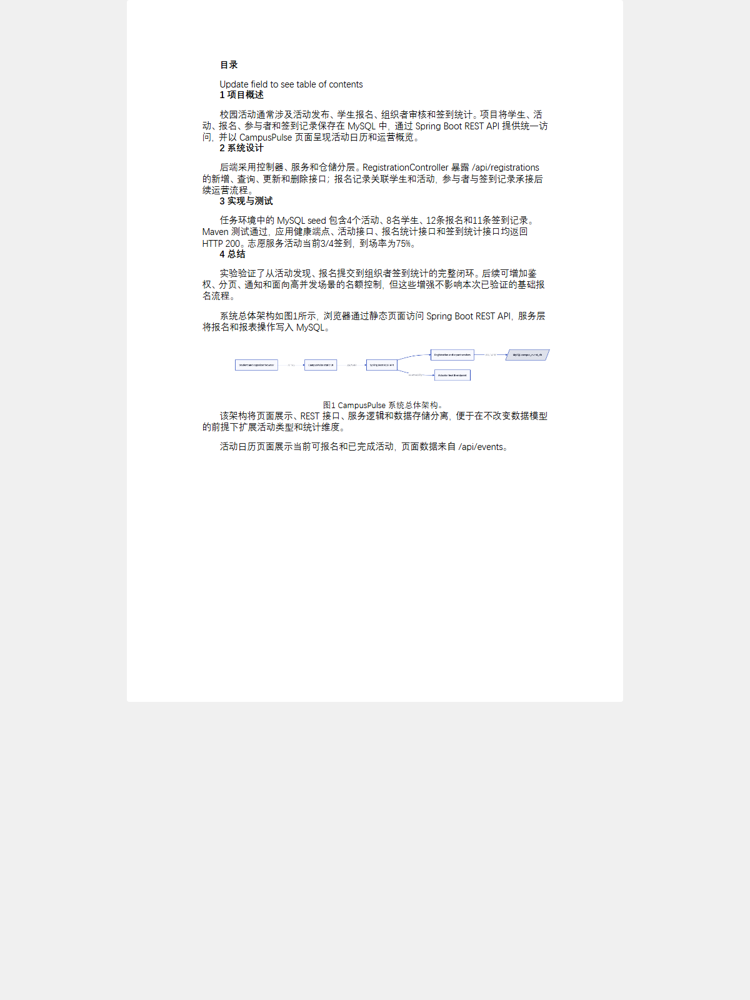
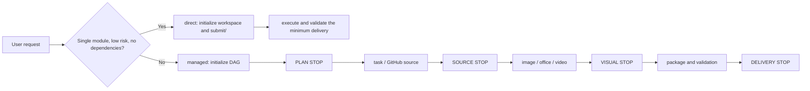

<div align="center">

# AutoFlow.skill

A verifiable Agent Skill for delivery work: direct execution for small tasks and resumable DAGs for connected work.

[](LICENSE)
[](https://github.com/qiuy-collab/AutoFlow.skill/actions)

**English · [简体中文](README.md)**

</div>

AutoFlow provides direct and managed modes across task, image, office, video, and package work. Managed runs pause at PLAN, SOURCE, VISUAL, and DELIVERY STOP gates for user decisions; plans, state, approvals, and artifact hashes are persisted so a run can be inspected and resumed.

## Showcase

All assets use one runnable demo: a Spring Boot + MySQL campus activity registration system. The left side is the original report template; the right side is the completed report grounded in real pages, the data model, and test results.

| Before filling | After filling |
| --- | --- |
|  |  |


See [display/README.md](display/README.md) for the complete browser evidence, project-specific AI-generated computer views, Word page renders, and the from-scratch thesis.

## Quick Start

Copy the complete prompt below into your Agent. It identifies the correct Skill directory for its own client rather than assuming a particular product or local path.

```text
Install the AutoFlow Skill from https://github.com/qiuy-collab/AutoFlow.skill.

1. Clone or download the complete repository. Determine the Skill installation directory required by the client you are running (for example ~/.newmax/skills/, ~/.claude/skills/, or the location in that client's documentation), then install the complete autoflow Skill directory there. Do not assume or hard-code a Codex-only path.
2. Verify that the installed directory contains SKILL.md, references/, modules/, scripts/, integrations/, and requirements.txt, and that all relative references resolve from the Skill root.
3. From the Skill root, read references/init.md first. Check Python, pip, Git, and Node; install Python dependencies from requirements.txt. As needed, install Playwright plus chromium, Mermaid CLI, D2, officecli, .NET, and ffmpeg. Complex Word reports/theses default to integrations/minimax-docx; the Agent may choose officecli when the task is simple.
4. From the Skill root run: python scripts/autoflow.py env-check --json and python scripts/autoflow.py capabilities --json. Report each capability as available, missing, or incomplete without printing APIKEY.
5. Never create, guess, or write user credentials in .env, including BASEURL, APIKEY, or VALIDATOR_* values. If they are absent, report AI image generation and prompt validation as blocked and wait for the user to configure them.
```

After installation, choose direct mode for a clear, low-risk, single-module deliverable without dependencies. Use managed mode when source selection, dependencies, documents, packaging, or resumable state are required.

## Flow



## Modules

| Module | Purpose |
| --- | --- |
| `task` | GitHub-first research, project builds, computation, and runnable evidence. |
| `image` | Real capture, AI-generated computer screenshots, deterministic diagrams, and charts from real data. |
| `office` | Word, PowerPoint, and Excel creation, fill, rendered review, and plan-aware validation. |
| `video` | Existing-video analysis, recording, creation, and processing. |
| `package` | Clean `submit/` delivery assembly and a verifiable manifest. |

## Integrated Packages

| Package | Purpose |
| --- | --- |
| `officecli` | Structured Office edits, OpenXML validation, and HTML rendering. |
| `minimaxdocx` / `minimax-docx` | Complex Word report/thesis authoring backend selected by the Agent; `officecli` still validates and renders. |
| `impeccable` | Frontend design language and offline quality checks. |
| `nature-figure` | Publication-quality chart templates with provenance and QA records. |

## Troubleshooting

- A capability is missing: install the dependency from [environment initialization](references/init.md), then re-run the capability check.
- An AI route is blocked: only the user may configure `.env` values such as `BASEURL`, `APIKEY`, and optional `VALIDATOR_*`; do not fabricate images.
- Browser capture fails: make the local app reachable, install `playwright`, then run `python -m playwright install chromium`.
- Mermaid or D2 is unavailable: install its CLI and confirm recognition with `autoflow.py capabilities --json`.
- Office validation fails: run `officecli validate` and `officecli view <file> issues --json`, then rerun `office_engine.py` and `validate_office.py`.
- A workflow refuses completion: verify every declared artifact path and hash; use `autoflow.py revise` before changing a registered artifact.
- `submit/` is rejected: remove build output, caches, editor metadata, secrets, and AutoFlow run metadata; keep only final deliverables.

## Test

```bash
python -m unittest discover -s tests
```

## License

[MIT](LICENSE) © [qiuy-collab](https://github.com/qiuy-collab)
