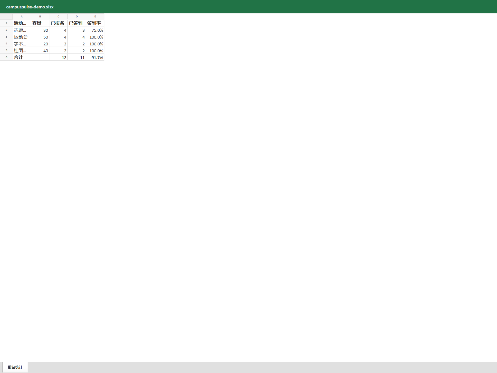
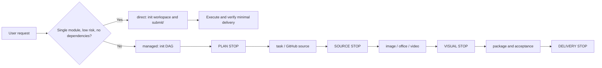

<div align="center">

# AutoFlow.skill

A verifiable Agent Skill for delivery work: direct execution for small tasks and resumable DAGs for connected work.

[](LICENSE)
[](https://github.com/qiuy-collab/AutoFlow.skill/actions)

**English · [简体中文](README.md)**

</div>

AutoFlow provides direct and managed modes across task, image, office, video, and package work. Managed runs pause at PLAN, SOURCE, VISUAL, and DELIVERY STOP gates for user decisions; plans, state, approvals, and artifact hashes are persisted so a run can be inspected and resumed.

## Quick Start

Copy the entire block below and send it to your Agent to install and initialize from GitHub:

```text
Please obtain and install the AutoFlow Skill from https://github.com/qiuy-collab/AutoFlow.skill.

1. Clone the repository or download its full contents; based on your client's conventions, determine the Skill installation directory (e.g. ~/.newmax/skills/, ~/.claude/skills/, or the location specified in your client's docs) and install the complete autoflow Skill directory there. Do not assume or hardcode a Codex-specific path.
2. Confirm the installed directory contains SKILL.md, references/, modules/, scripts/, integrations/, and requirements.txt, and that all relative references are reachable from the Skill root.
3. At the Skill root, read references/init.md first. Check Python, pip, Git, Node; install Python dependencies from requirements.txt. Install Playwright + chromium, Mermaid CLI, D2, officecli, .NET, and ffmpeg as needed. Complex Word reports/theses default to integrations/minimax-docx; the Agent may also choose officecli per task.
4. At the Skill root, run: python scripts/autoflow.py env-check --json and python scripts/autoflow.py capabilities --json. Report each as available, missing, or incomplete. Do not output APIKEY values.
5. Do not create, guess, or write .env credentials (BASEURL, APIKEY, VALIDATOR_*) on behalf of the user. If credentials are missing, state that AI image generation and prompt validation are blocked and wait for the user to configure them.
```

After installation, task scope determines the execution mode: single-module, no-dependency deliveries go direct; deliveries involving source selection, dependencies, documents, packaging, or recoverable state go managed.

## Showcase

All assets are generated from one demo project: a Spring Boot + MySQL campus activity registration system.

| Before filling | After filling |
| --- | --- |
|  |  |

## Image Module

The Image module covers four subcategories, all shown below.

### capture — Real browser screenshots

Captures real pages from a locally running web application via Playwright.

```bash
python scripts/capture_frontend_screenshots.py --config <capture-plan.json> --output-dir <dir>
```

| | | |
|:---:|:---:|:---:|
|  |  |  |
| dashboard | activity-calendar | registration |
|  | | |
| operations | | |

### ai — AI-generated screenshots

Covers terminal commands, IDE development, Linux operations, and nature-figure scientific graphics.

```bash
python scripts/generate_images.py --config <prompt-config.json>
```

| | | |
|:---:|:---:|:---:|
|  |  |  |
| Maven build | VS Code source | Graphical abstract |
|  |  |  |
| SQL query | Network verification | Git commit |
|  |  |  |
| VS Code debugging | DevTools network panel | Maven test |

### diagram — Deterministic diagrams

DSL-based rendering producing architecture, ER, flowchart, class, sequence, use case, and network topology diagrams.

```bash
python scripts/generate_diagram_assets.py --config <diagram-plan.json> --output-dir <dir>
```

| | | |
|:---:|:---:|:---:|
|  |  |  |
| Architecture | ER diagram | Business flow |
|  |  |  |
| Class diagram | Sequence diagram | Use case diagram |
|  | | |
| Deployment topology | | |

### chart — Data charts

Publication-grade chart templates via nature-figure: volcano plots, ROC curves, dotplots, marginal distributions, and more.

```bash
python integrations/nature-figure/scripts/plot_templates.py <template> ...
```

| | | |
|:---:|:---:|:---:|
|  |  |  |
| Metric matrix | Capacity comparison | Volcano plot |
|  |  |  |
| ROC curve | Category dotplot | Marginal distribution |

## Office Module

### Word template filling

Reads a report template, fills it with real project evidence, validates via officecli, and renders page by page.

```bash
python scripts/office_engine.py --action fill --format word ...
python scripts/validate_office.py <file>.docx
```

| Page 1 | Page 2 |
|:---:|:---:|
|  |  |
| Page 3 | |
|  | |

### Word from scratch

Creates a graduation thesis from scratch with table of contents, body, figures, and references, validated page by page via officecli.

| Page 1 | Page 2 |
|:---:|:---:|
|  |  |
| Page 3 | Page 4 |
|  |  |

### Excel creation

Creates styled spreadsheets with formulas via officecli.

```bash
python scripts/office_engine.py --action create --format excel ...
```



## Pipeline Overview



## Five Modules

| Module | Purpose |
| --- | --- |
| `task` | GitHub-first retrieval, project building, computation, and runnable evidence. |
| `image` | Real capture, AI-generated desktop screenshots, deterministic diagrams, and data-grounded charts. |
| `office` | Word, PPT, and Excel creation, filling, rendering review, and plan-level validation. |
| `video` | Video analysis, recording, generation, and processing. |
| `package` | Assemble a clean `submit/` delivery folder with a verifiable manifest. |

## Plugins

AutoFlow ships with the following four plugins by default; users can add more:

| Plugin | Purpose |
| --- | --- |
| `officecli` | Structured Office editing, OpenXML validation, and HTML rendering. |
| `minimax-docx` | Complex Word report/thesis creation and fill backend; selected per task by the Agent, always validated and rendered via `officecli`. |
| `impeccable` | Frontend design language and offline quality-check adapter. |
| `nature-figure` | Publication-grade chart templates with data provenance and QA records. |

## Sponsor

[sshzyu.com](https://sshzyu.com) provides the AI image generation API.

## FAQ

- `capabilities` shows missing: install the required dependencies per [Environment Setup](references/init.md), then re-check.
- AI routing is blocked: only the user configures `.env` with `BASEURL`, `APIKEY`, and optional `VALIDATOR_*`; never fabricate images.
- Browser capture fails: confirm the local app is reachable, install `playwright`, then run `python -m playwright install chromium`.
- Mermaid or D2 unavailable: install the corresponding CLI and confirm the renderer via `autoflow.py capabilities --json`.
- Office validation fails: use `officecli validate` and `officecli view <file> issues --json` to locate the problem, then run `office_engine.py` and `validate_office.py`.
- Workflow refuses to complete a node: verify each declared artifact's absolute path and hash; run `autoflow.py revise` before modifying registered artifacts.
- `submit/` rejected: remove build output, caches, editor metadata, secrets, and AutoFlow run metadata; keep only final deliverables.

## Tests

```bash
python -m unittest discover -s tests
```

## License

[MIT](LICENSE) © [qiuy-collab](https://github.com/qiuy-collab)
