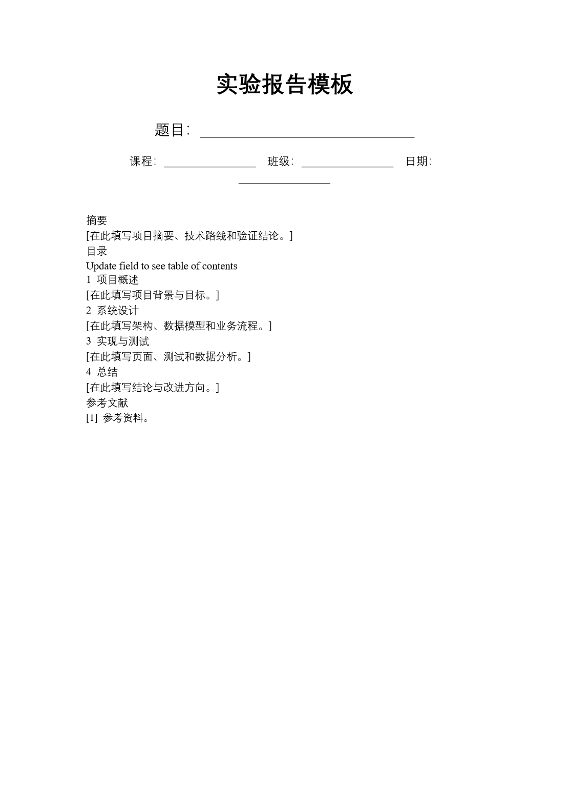
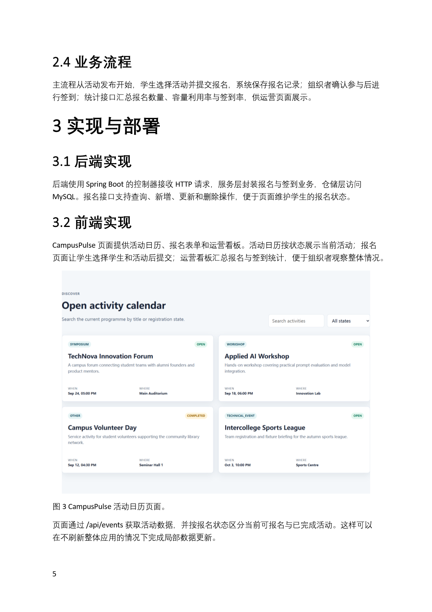
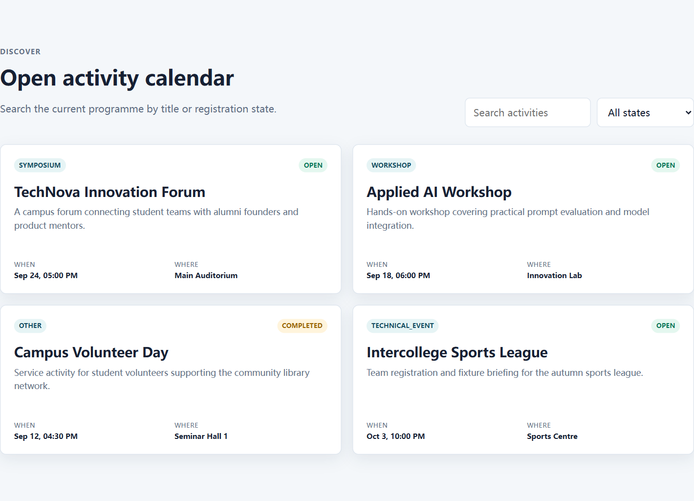
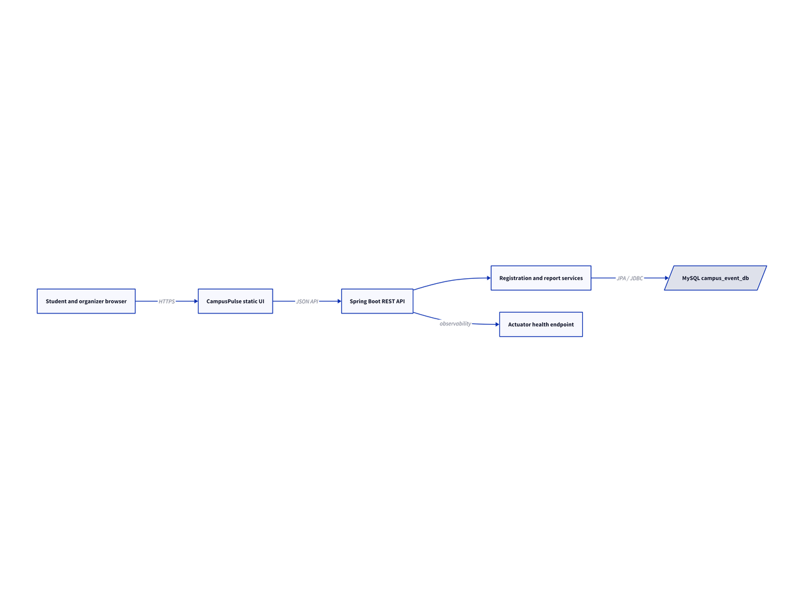
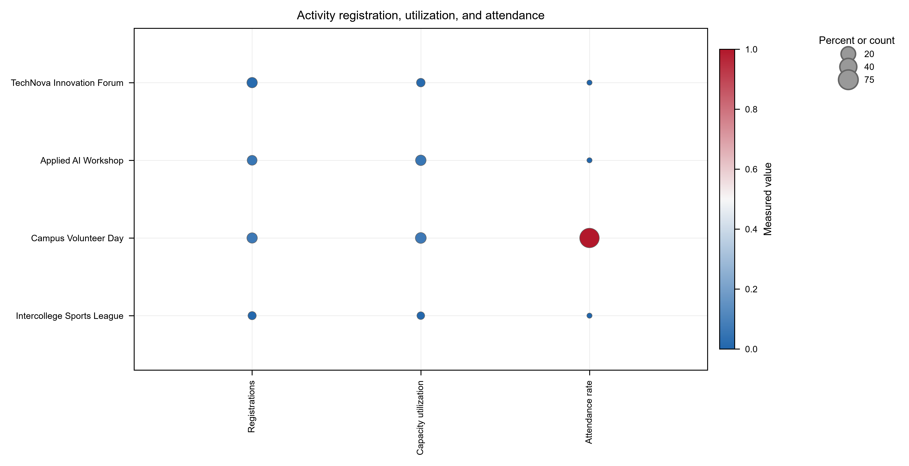
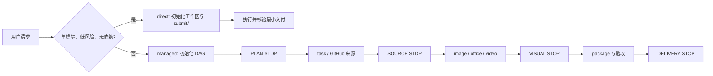

<div align="center">

# AutoFlow.skill

面向可验证交付的 Agent Skill：小任务可直接执行，关联任务以可续跑 DAG 管理。

[](LICENSE)
[](https://github.com/qiuy-collab/AutoFlow.skill/actions)

**简体中文 · [English](README.en.md)**

</div>

AutoFlow 提供 direct 与 managed 两种模式，覆盖 task、image、office、video 和 package。managed 模式在 PLAN、SOURCE、VISUAL、DELIVERY 四类 STOP 门停下等待用户决策，计划、状态、审批和产物哈希均落盘，可检查也可续跑。

## 效果展示

同一演示项目为「基于 Spring Boot + MySQL 的校园活动报名管理系统」。左侧是填写前模板，右侧是使用真实页面、数据模型和测试结果填写后的报告。

| 填写前 | 填写后 |
| --- | --- |
|  |  |







更多浏览器截图、AI 生成的项目相关电脑界面、逐页 Word 渲染和从零论文见 [display/README.md](display/README.md)。

## Quick Start

复制下面整段发给你的 Agent。它会根据自身客户端识别 Skill 安装目录，而不假设特定 Agent 品牌或本机路径。

```text
请从 https://github.com/qiuy-collab/AutoFlow.skill 获取并安装 AutoFlow Skill。

1. 克隆仓库或下载其完整内容；根据你正在运行的客户端约定，确定该客户端的 Skill 安装目录（例如 ~/.newmax/skills/、~/.claude/skills/ 或该客户端文档规定的位置），将完整 autoflow Skill 目录安装进去。不要假设或硬编码 Codex 专属路径。
2. 确认安装后的目录包含 SKILL.md、references/、modules/、scripts/、integrations/、requirements.txt，且所有相对引用仍从 Skill 根目录可达。
3. 在 Skill 根目录先阅读 references/init.md。检查 Python、pip、Git、Node；安装 requirements.txt 的 Python 依赖。按需安装 Playwright 与 chromium、Mermaid CLI、D2、officecli、.NET 和 ffmpeg；复杂 Word 报告/论文默认使用 integrations/minimax-docx，Agent 也可按任务选择 officecli。
4. 在 Skill 根目录运行：python scripts/autoflow.py env-check --json 和 python scripts/autoflow.py capabilities --json。逐项汇报 available、missing 或 incomplete，不得输出 APIKEY。
5. 不要替用户创建、猜测或写入 .env 中的 BASEURL、APIKEY、VALIDATOR_* 等凭据。凭据缺失时，说明 AI 生图和提示词质检被阻塞，并等待用户自行配置后再继续。
```

安装完成后，任务规模决定执行模式：单模块、无依赖的小交付走 direct；涉及来源选择、相互依赖、文档、打包或可恢复状态的交付走 managed。

## 链路总览



## 五个模块

| 模块 | 用途 |
| --- | --- |
| `task` | GitHub-first 检索、项目构建、计算和可运行性证据。 |
| `image` | 真实捕获、AI 生成电脑截图、确定性图和基于真实数据的图表。 |
| `office` | Word、PPT、Excel 的创建、填充、渲染审查和计划级校验。 |
| `video` | 既有视频分析、录制、生成和处理。 |
| `package` | 依据需求组装干净的 `submit/` 交付目录与可验证清单。 |

## 集成包

| 集成 | 用途 |
| --- | --- |
| `officecli` | Office 文档的结构化编辑、OpenXML 校验和 HTML 渲染。 |
| `minimaxdocx` / `minimax-docx` | 复杂 Word 报告/论文创建与填充后端；由 Agent 按任务选择，仍由 `officecli` 校验和渲染。 |
| `impeccable` | 前端设计语言与离线质量检测适配。 |
| `nature-figure` | 具有数据来源和质量记录的出版级图表模板。 |

## 常见问题

- `capabilities` 显示缺失：先按 [环境初始化](references/init.md) 安装对应依赖，再重新检查。
- AI 路由被阻塞：仅由用户配置 `.env` 的 `BASEURL`、`APIKEY` 和可选 `VALIDATOR_*`；不要伪造图片。
- 浏览器截图失败：确认本地应用可访问，安装 `playwright` 后执行 `python -m playwright install chromium`。
- Mermaid 或 D2 不可用：安装对应 CLI，并用 `autoflow.py capabilities --json` 确认渲染器已被识别。
- Office 校验失败：用 `officecli validate` 和 `officecli view <file> issues --json` 定位问题，再运行 `office_engine.py` 与 `validate_office.py`。
- 工作流拒绝完成节点：检查每个声明产物的绝对路径和哈希；修改已登记产物时先运行 `autoflow.py revise`。
- `submit/` 被拒绝：移除构建输出、缓存、编辑器元数据、密钥和 AutoFlow 运行元数据，只保留最终交付物。

## 测试

```bash
python -m unittest discover -s tests
```

## License

[MIT](LICENSE) © [qiuy-collab](https://github.com/qiuy-collab)
