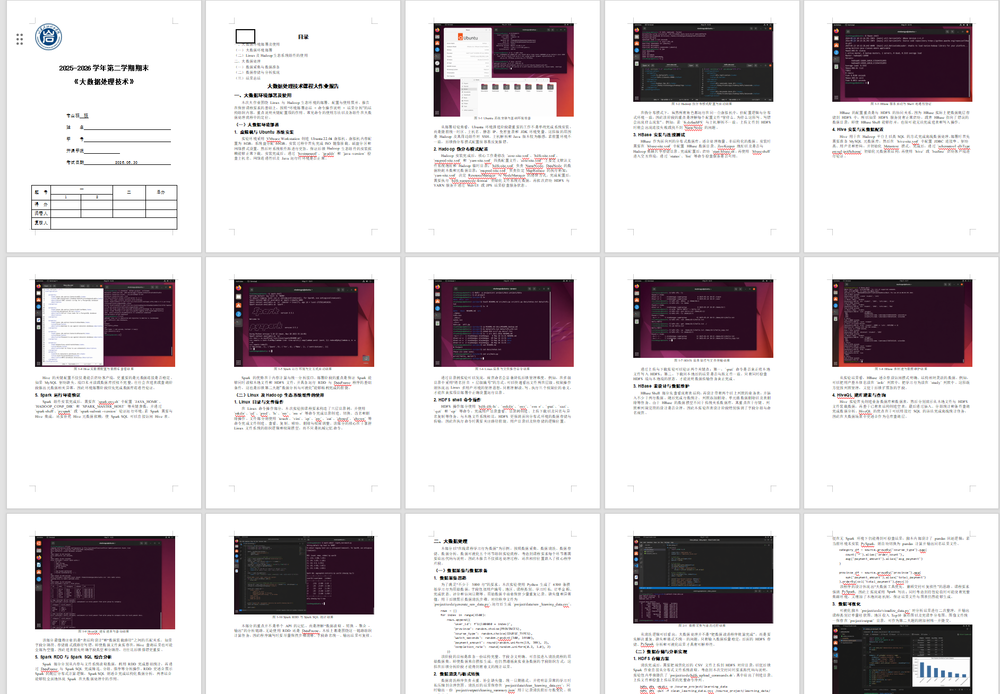
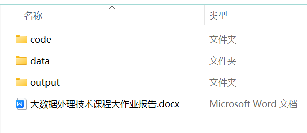

<div align="center">

# AutoFlow.skill

把代码、图表、文档、PPT、视频和交付包串成一条可检查、可中断、可继续的工作流。

[](LICENSE)
[](https://github.com/qiuy-collab/AutoFlow.skill/releases)
[](https://www.python.org/)
[](https://github.com/qiuy-collab/AutoFlow.skill/actions)

**English: [README.en.md](README.en.md) · 简体中文**

</div>

## 这是什么

AutoFlow 是一个面向多步骤交付任务的 Agent Skill。它不替 Agent 做判断，而是把容易散落在对话里的计划、依赖、审批和产物记录下来，让一次复杂任务能被检查，也能在中断后继续。

例如，“完成一个学生管理系统，写论文，再做答辩 PPT”会被拆成源码调研、项目实现、截图、论文、演示文稿和打包几个步骤。每一步都有明确输入、输出和验收条件；源码选型、视觉效果和最终交付会在关键位置停下来等用户确认。

它也适合实验报告、项目交付、数据分析报告、演示文稿、视频作业，以及需要同时生成多种文件的自定义任务。只改一个文件或回答一个简单问题时，一般不需要 AutoFlow。

## 六个模块

| 模块 | 负责的事情 |
| --- | --- |
| `task` | 调研、GitHub 源码选型、项目改造、计算和真实执行 |
| `image` | 截图、AI 图片、流程图/架构图、科研图和数据图表 |
| `word` | DOCX 创建、编辑、模板填写和结构验收 |
| `ppt` | PPTX 创建、编辑、渲染和视觉检查 |
| `video` | 视频分析、录屏、生成、转码和媒体验收 |
| `package` | 按交付要求整理 `submit/`、生成清单和压缩包 |

模块可以自由组合。AutoFlow 内置了常见 recipe，也允许根据任务生成自定义 DAG：

| Recipe | 流程 |
| --- | --- |
| `lab-report` | task → image → word → package |
| `report-and-slides` | task → image → word + ppt → package |
| `project-delivery` | GitHub discovery → build → image → package |
| `project-and-report` | GitHub discovery → build → image → word → package |
| `project-report-and-slides` | GitHub discovery → build → image → word + ppt → package |
| `video-delivery` | video → package |
| `document` | 可选 task/image → word |
| `presentation` | 可选 task/image → ppt |
| `custom` | 按需求生成任意 DAG |

## 两种执行方式

AutoFlow 不会把所有请求都塞进完整工作流。

- **Direct mode**：一个模块、一个语义产物、没有依赖和关键选择时，直接读取模块规则、生成、检查并交付。例如只生成一张 ER 图时，默认只交付一个便于查看的成品；用户确实需要 `.mmd/.svg/.png` 多格式时，它们仍算同一个图，不因此创建计划、状态文件、`submit/` 或 STOP。
- **Managed mode**：多个模块或上下游产物、GitHub 源码选型、提交包、复杂评分/模板映射、需要恢复与审计，或存在重要外部决策时，才初始化 DAG 和 STOP。

显式写“使用 autoflow”表示使用 AutoFlow 来路由任务，不代表必须走 Managed mode。Direct mode 可以用下面的命令查看本地模块与渲染器，不会创建工作流文件：

```bash
python scripts/autoflow.py direct-route \
  --module image --action diagram --json
```

## 工作方式

AutoFlow 把一次运行放在独立的 `autoflow/` 目录中：

```text
autoflow/
├── .autoflow/
│   ├── config/          # workflow、状态、审批和需求映射
│   ├── intermediate/    # 计划、中间产物、日志和验证报告
│   ├── runtime/         # 自动补齐的隔离运行环境
│   └── scripts/         # 本次任务专用脚本
└── submit/              # 最终交付文件
```

Agent 负责理解任务、调用工具和完成实际工作；Python CLI 负责检查 DAG、状态转换、审批门和产物哈希。核心 CLI 不提供“一键假装完成全部步骤”的 `run` 命令。

Managed mode 的四个 STOP 用来保留用户的决定权。每次请求确认前，Agent 必须先展示可审核的信息和文件路径，不能只问“是否同意”：

- `PLAN_STOP`：确认工作范围、步骤和预期产物后再开始。
- `SOURCE_STOP`：代码任务找到合适的 GitHub 项目时，列出候选，用户选定后才克隆和改造。
- `VISUAL_STOP`：图片、图表或视觉型 PPT 生成后先看效果，再交给下游文档使用。
- `DELIVERY_STOP`：所有检查通过后展示交付清单，用户签收后才结束工作流。

审核信息包可以由 CLI 生成：

```bash
python scripts/autoflow.py review \
  --workflow autoflow/.autoflow/config/workflow.json \
  --gate plan
```

如果没有合适的 GitHub 候选，AutoFlow 会保留查询和排除理由，然后从头实现，不会为了走流程虚构候选。

## 快速开始

把下面这句话和你的任务一起交给 Agent：

```text
请使用 autoflow 完成这个任务。先读取 SKILL.md，根据需求选择 recipe，
生成 WORK_PLAN.md 后等我确认；不要绕过源码、视觉和交付 STOP。
```

也可以手动初始化：

```bash
python scripts/autoflow.py init \
  --request-file request.md \
  --output-dir autoflow \
  --recipe auto

python scripts/autoflow.py status \
  --workflow autoflow/.autoflow/config/workflow.json

python scripts/autoflow.py validate \
  --workflow autoflow/.autoflow/config/workflow.json
```

查看当前可执行步骤和本地能力路由：

```bash
python scripts/autoflow.py next \
  --workflow autoflow/.autoflow/config/workflow.json

python scripts/autoflow.py route \
  --workflow autoflow/.autoflow/config/workflow.json \
  --step <step-id> --json --compact

python scripts/autoflow.py integrations --json
```

旧版 AutoLab 的 `workflow.json` 与 AutoFlow Schema 1.0 不兼容，需要重新初始化。

## 内置能力

AutoFlow 把运行所需的关键能力收进仓库，并记录上游地址、revision、许可证和本地适配器。这样换一台设备时不必假设某个外部 Skill 已安装，也能避免只在文字里声称“调用成功”。

当前集成包括：

- `minimax-docx`：DOCX/OpenXML 创建、模板处理和结构验证。
- `nature-figure`：科研示意图与科学图表类型。
- `presentation-skill`：PPTX 生成、渲染和视觉 QA。
- `webapp-testing`：基于 Playwright 的网页测试与截图证据。
- `impeccable`：前端设计规则和离线质量检测。
- `superpowers`、`agent-skills`、`engineering-quality`：规划、调试、测试、安全、性能和发布方法。

AI 图片直接读取 AutoFlow 的 `.env` 上游配置，不依赖 OpenRouter。普通缺失环境由模块在 `.autoflow/runtime/` 中自动准备，不写进最终交付目录。

环境检查：

```bash
python scripts/env_setup.py --check-only --route all --no-probe
```

## 仓库结构

```text
autoflow/
├── SKILL.md             # 路由入口
├── modules/             # task / image / word / ppt / video / package
├── recipes/             # 内置 DAG 模板
├── references/          # Workflow、STOP、验收和环境协议
├── integrations/        # 已审计并固定版本的内置能力
├── scripts/             # 状态机、适配器和各模块后端
├── tests/               # 单元与集成测试
├── evals/               # 场景评估
├── examples/            # 示例配置和真实交付样例
└── docs/                # GitHub Pages 与效果图
```

更详细的目录职责见 [`references/directory-layout.md`](references/directory-layout.md)，工作流字段见 [`references/workflow-contract.md`](references/workflow-contract.md)。

## 效果示例

### 生成的文档



### 最终交付目录



## 测试

```bash
python -m unittest discover -s tests -v
python -m compileall -q scripts tests
```

测试覆盖 DAG 和循环依赖、状态转换、四类 STOP、GitHub 有/无候选、环境自动补齐、Word/PPT/视频验收、图片与科研图路由、敏感文件拒绝、隔离复测以及只包含声明产物的打包流程。

## 版本记录

版本变化见 [`CHANGELOG.md`](CHANGELOG.md)。

## License

[MIT License](LICENSE) © [qiuy-collab](https://github.com/qiuy-collab)
